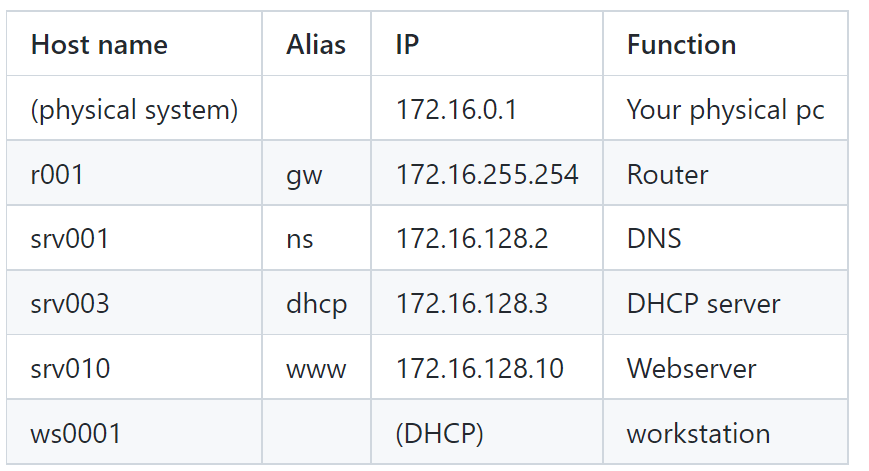
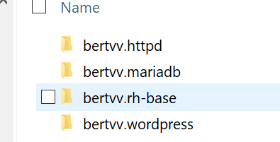
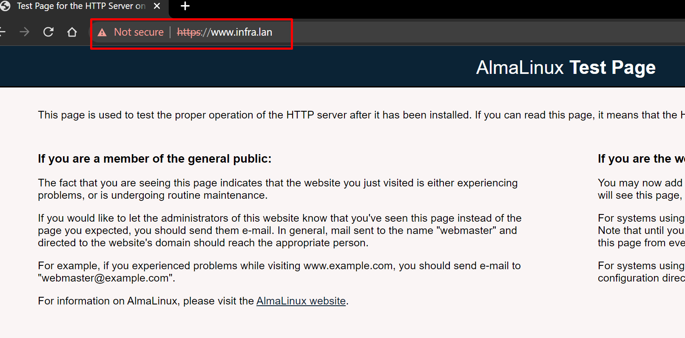
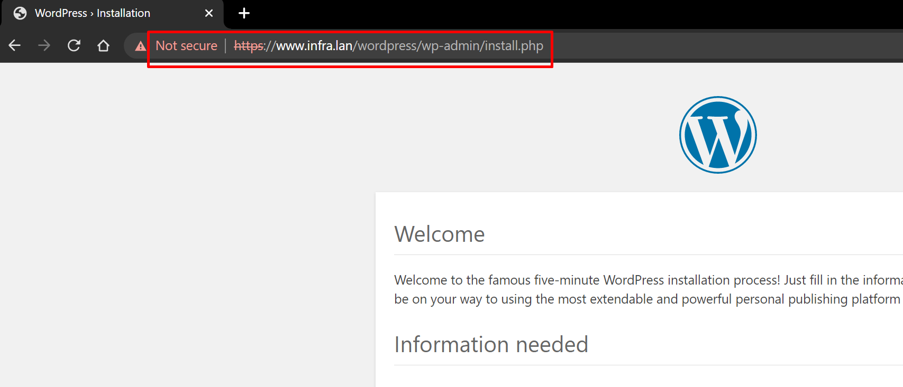
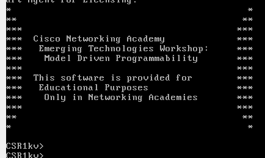
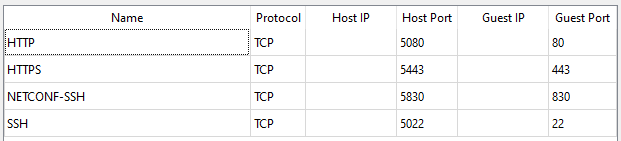
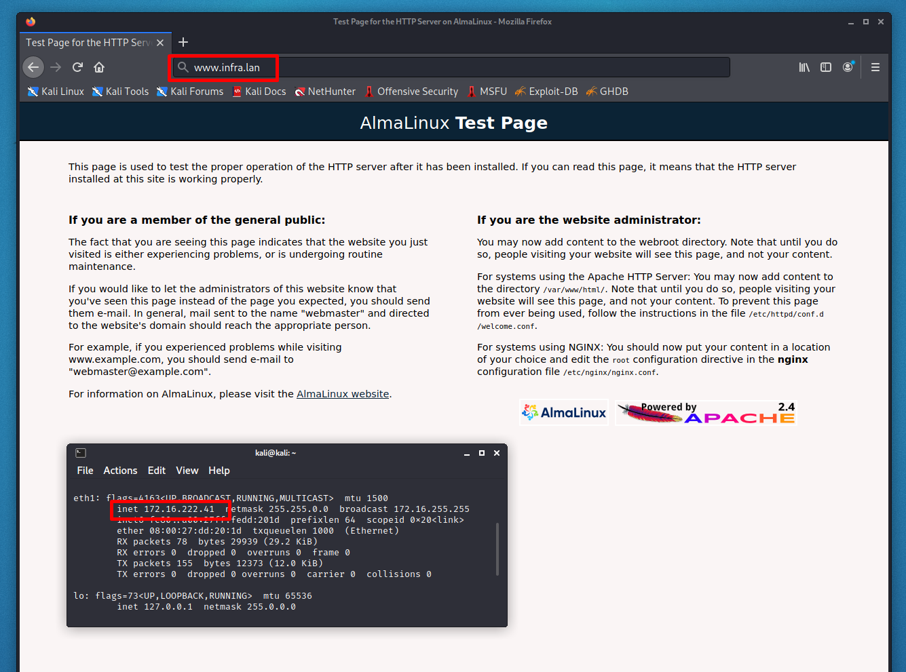
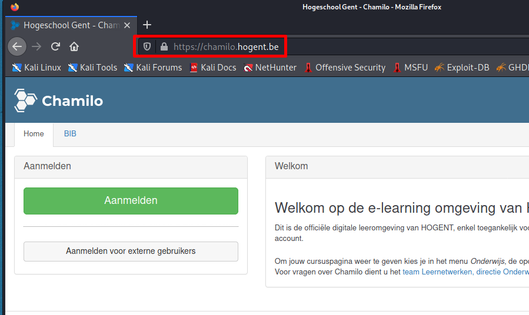

# Assignment 04 - Configuration management

- [Assignment 04 - Configuration management](#assignment-04---configuration-management)
- [1. Objective:](#1-objective-)
- [2. Initial set-up srv010 `172.16.128.10` will become web a server](#2-initial-set-up-srv010--1721612810--will-become-web-a-server)
  * [Starting up srv010 `vargrant up srv010` and getting some info about distro](#starting-up-srv010--vargrant-up-srv010--and-getting-some-info-about-distro)
- [3. Basic server setup and adding role](#3-basic-server-setup-and-adding-role)
  * [Installing extra software:](#installing-extra-software-)
  * [Adding extra packages](#adding-extra-packages)
  * [Adding a user:pass](#adding-a-user-pass)
  * [ssh-in with an new user](#ssh-in-with-an-new-user)
- [3. Configure web app on srv010](#3-configure-web-app-on-srv010)
  * [Database server mariaDB](#database-server-mariadb)
  * [Verify DB](#verify-db)
  * [Verify log in:](#verify-log-in-)
  * [Apache](#apache)
  * [Configurating](#configurating)
  * [Setting FireWall correctly](#setting-firewall-correctly)
  * [Installing wordpress](#installing-wordpress)
- [DNS](#dns)
  * [Journal](#journal)
  * [Querying dns from srv010](#querying-dns-from-srv010)
  * [Bind zones settings:](#bind-zones-settings-)
  * [infra.lan setup](#infralan-setup)
  * [Pages are now seen with infra.lan and www.infra.lan](#pages-are-now-seen-with-infralan-and-wwwinfralan)
- [DHCP](#dhcp)
  * [DHCP playbook](#dhcp-playbook)
  * [De dhcp service is runnig](#de-dhcp-service-is-runnig)
- [Router](#router)
  * [In the router with `ssh -o StrictHostKeyChecking=no -p 22 cisco@172.16.255.254` from VM](#in-the-router-with--ssh--o-stricthostkeychecking-no--p-22-cisco-17216255254--from-vm)
  * [Configuring the second interface to be up/up with provided IP](#configuring-the-second-interface-to-be-up-up-with-provided-ip)
  * [Router output for `ansible -i inventory.yml -m ios_facts -a "gather_subset=all" all`](#router-output-for--ansible--i-inventoryyml--m-ios-facts--a--gather-subset-all--all-)
  * [Adding router into playbook](#adding-router-into-playbook)
  * [Pinging router from VM machine](#pinging-router-from-vm-machine)
- [New machine in network is getting IP from dhcp](#new-machine-in-network-is-getting-ip-from-dhcp)
  * [And the lease in srv003](#and-the-lease-in-srv003)
- [Working internet on new added machine](#working-internet-on-new-added-machine)
  * [And internet access](#and-internet-access)

# 1. Objective:


# 2. Initial set-up srv010 `172.16.128.10` will become web a server
```bash
C:\Users\ilyam\Desktop\Infrastructure automation\infra-2122-pl77711\vmlab (solution -> origin)
λ vagrant status
Current machine states:

srv010                    not created (virtualbox) 
```

## Starting up srv010 `vargrant up srv010` and getting some info about distro
Fresh distro:
```bash
PLAY RECAP *********************************************************************
srv010                     : ok=1    changed=0    unreachable=0    failed=0    skipped=0    rescued=0    ignored=0
```
- info about distro:
```bash
[vagrant@srv010 etc]$ hostnamectl
   Static hostname: srv010
         Icon name: computer-vm
           Chassis: vm
        Machine ID: e5d89b5d2a9243dcbbe2cf44b80d29db
           Boot ID: 90b9ca9214e54351a6799bbe079cb4d4
    Virtualization: oracle
  Operating System: AlmaLinux 8.4 (Electric Cheetah)
       CPE OS Name: cpe:/o:almalinux:almalinux:8.4:GA
            Kernel: Linux 4.18.0-305.17.1.el8_4.x86_64
      Architecture: x86-64
```

- linux distribution:
```bash
[vagrant@srv010 etc]$ lsb_release -a
LSB Version:    :core-4.1-amd64:core-4.1-noarch
Distributor ID: AlmaLinux
Description:    AlmaLinux release 8.4 (Electric Cheetah)
Release:        8.4
Codename:       ElectricCheetah
```

- some info about this distribution:
    - [https://www.youtube.com/watch?v=vMshlo2tJsc](https://www.youtube.com/watch?v=vMshlo2tJsc)
    - [https://www.linuxshelltips.com/almalinux-download/](https://www.linuxshelltips.com/almalinux-download/)


- Linux kernel
```bash
[vagrant@srv010 etc]$ uname -a
Linux srv010 4.18.0-305.17.1.el8_4.x86_64 #1 SMP Wed Sep 8 03:45:51 EDT 2021 x86_64 x86_64 x86_64 GNU/Linux
```

# 3. Basic server setup and adding role
The easiest way to configure a VM is to apply a role. A role is a playbook that is written to be reusable. It contains a general description of the desired state of the target system, and you can customize it for your specific case by setting role variables.

Adding role to setup.
It does some basic configuration tasks for improving security (like enabling SELinux and starting the firewall) and allows the user to specify some desired configuration options like packages to install, users or groups to create, etc. by initializing some role variables. 

I work on Windows machine so i just execute provided script
```bash
λ .\scripts\role-deps.sh
```

```yaml
# site.yml
---
- hosts: all    # Indicate hosts this applies to (host or group name)
  roles:        # Enumerate roles to be applied
    - bertvv.rh-base
```

And accept the changes by provisioning the setup.
```bash
PLAY RECAP *********************************************************************
srv010                     : ok=34   changed=15   unreachable=0    failed=0    skipped=18   rescued=0
  ignored=0
```

## Installing extra software:
```yaml
# group_vars/all.yml
# Variables visible to all nodes
---
rhbase_repositories:
  - epel-release
rhbase_install_packages:
  - bash-completion
  - vim-enhanced
```
These variables will result in the following changes:

The package repository EPEL (Extra Packages for Enterprise Linux) is installed and enabled
The software packages bash-completion and vim-enhanced are installed

And provision again:
```bash
PLAY RECAP *********************************************************************
srv010                     : ok=32   changed=1    unreachable=0    failed=0    skipped=18   rescued=0
  ignored=0
```

## Adding extra packages
```yaml
# group_vars/all.yml
# Variables visible to all nodes
---
rhbase_repositories:
  - epel-release
rhbase_install_packages:
  - bash-completion
  - vim-enhanced
  - bind-utils
  - git
  - nano
  - tree
  - wget
```
And provision again:
```bash
PLAY RECAP *********************************************************************
srv010                     : ok=32   changed=1    unreachable=0    failed=0    skipped=18   rescued=0
  ignored=0
```

## Adding a user:pass 

```yaml
# group_vars/all.yml
# Variables visible to all nodes
---
rhbase_repositories:
  - epel-release
rhbase_install_packages:
  - bash-completion
  - vim-enhanced
  - bind-utils
  - git
  - nano
  - tree
  - wget
rhbase_users:
  - name: ilya
    password: 'password'
    ssh_key: 'ssh-ed25519 AAAAC3NzaC1lZDI1NTE5AAAAIMJOkHZYpBC6YuX7OO5XbW4pXOSyi8pC2itbkGhEzv0O ilya.mikhaylov@student.hogent.be'
```
And provision again:
```bash
PLAY RECAP *********************************************************************
srv010                     : ok=35   changed=2    unreachable=0    failed=0    skipped=15   rescued=0
  ignored=0
```
User is added 
```bash
ilya:x:1001:1001::/home/ilya:/bin/bash
```

## ssh-in with an new user 
```bash
λ ssh ilya@172.16.128.10
The authenticity of host '172.16.128.10 (172.16.128.10)' can't be established.
ECDSA key fingerprint is SHA256:IpH8qcy1/FtH+E0lbHw5v8/KYmHgcyq4A6+JT/MP1tE.
Are you sure you want to continue connecting (yes/no/[fingerprint])? yes
Warning: Permanently added '172.16.128.10' (ECDSA) to the list of known hosts.

This system is built by the Bento project by Chef Software
More information can be found at https://github.com/chef/bento
[ilya@srv010 ~]$ id
uid=1001(ilya) gid=1001(ilya) groups=1001(ilya) context=unconfined_u:unconfined_r:unconfined_t:s0-s0:c0.c1023
[ilya@srv010 ~]$
```

Since the previous changes were applied to group_vars/all.yml, every VM that we will add to our environment will automatically have these properties.

# 3. Configure web app on srv010
## Database server mariaDB

First add role 


Update group_vars for all

```yaml
# group_vars/all.yml
# Variables visible to all nodes
---
rhbase_repositories:
  - epel-release
rhbase_install_packages:
  - bash-completion
  - vim-enhanced
  - bind-utils
  - git
  - nano
  - tree
  - wget
rhbase_users:
  - name: ilya
    password: 'password'
    ssh_key: 'ssh-ed25519 AAAAC3NzaC1lZDI1NTE5AAAAIMJOkHZYpBC6YuX7OO5XbW4pXOSyi8pC2itbkGhEzv0O ilya.mikhaylov@student.hogent.be'
mariadb_databases:
  - name: wordpress
mariadb_users:
  - name: wordpress
    password: password #just for to make it easy
    priv: '*.*:ALL'
mariadb_root_password: 'password'
```
And provision again:
```bash
TASK [bertvv.mariadb : Install packages] ***************************************
...
PLAY RECAP *********************************************************************
srv010                     : ok=57   changed=15   unreachable=0    failed=0    skipped=21   rescued=0
  ignored=0
```
## Verify DB

```bash
MariaDB [(none)]> show databases;
+--------------------+
| Database           |
+--------------------+
| information_schema |
| mysql              |
| performance_schema |
| sys                |
| wordpress          |
+--------------------+
5 rows in set (0.004 sec)
```
```bash
MariaDB [(none)]> select user,host,password from mysql.user;
+-------------+-----------+-------------------------------------------+
| User        | Host      | Password                                  |
+-------------+-----------+-------------------------------------------+
| mariadb.sys | localhost |                                           |
| root        | localhost | invalid                                   |
| mysql       | localhost | invalid                                   |
| wordpress   | localhost | *2470C0C06DEE42FD1618BB99005ADCA2EC9D1E19 |
+-------------+-----------+-------------------------------------------+
```
## Verify log in:
```bash
[vagrant@srv010 ~]$ mysql -uwordpress -ppassword wordpress
Welcome to the MariaDB monitor.  Commands end with ; or \g.
Your MariaDB connection id is 6
Server version: 10.6.4-MariaDB MariaDB Server

Copyright (c) 2000, 2018, Oracle, MariaDB Corporation Ab and others.

Type 'help;' or '\h' for help. Type '\c' to clear the current input statement.

MariaDB [wordpress]>
```
## Apache
Installing roles:

And creating certs:
```bash
[vagrant@srv010 home]$ cd /vagrant/ansible/roles/bertvv.httpd/files/
[vagrant@srv010 files]$ ls
ca.csr  ca.key
``` 
## Configurating
```bash
# group_vars/all.yml
# Variables visible to all nodes
---
rhbase_repositories:
  - epel-release
rhbase_install_packages:
  - bash-completion
  - vim-enhanced
  - bind-utils
  - git
  - nano
  - tree
  - wget
rhbase_users:
  - name: ilya
    password: 'password'
    ssh_key: 'ssh-ed25519 AAAAC3NzaC1lZDI1NTE5AAAAIMJOkHZYpBC6YuX7OO5XbW4pXOSyi8pC2itbkGhEzv0O ilya.mikhaylov@student.hogent.be'
mariadb_databases:
  - name: wordpress
mariadb_users:
  - name: wordpress
    password: password #just for to make it easy
    priv: '*.*:ALL'
mariadb_root_password: 'password'
httpd_ssl_certificate_key_file: 'ca.key'
httpd_ssl_certificate_file: 'ca.crt'
rhbase_firewall_allow_services: [http, https]
```

## Setting FireWall correctly
```yaml
    rhbase_firewall_allow_services: [http, https]
```
## Installing wordpress
```bash
PLAY RECAP *********************************************************************
srv010                     : ok=84   changed=11   unreachable=0    failed=0    skipped=35   rescued=0    ignored=0
```

# DNS

Refactored to appart file 
```bash
#host_vars/srv001
---
bind_allow_query: ['any']
bind_recursion: true
bind_forward_only: true
bind_forwarders: ['10.0.2.3', '8.8.8.8']
bind_dnssec_enable: false
```
Is running
```bash
rpcbind.service                    loaded active running RPC Bind
```
Port 53 is listening
```bash
 users:(("rpcbind",pid=524,fd=4),("systemd",pid=1,fd=27))
tcp         LISTEN       0            10                     127.0.0.1:53                    0.0.0.0:*
```

## Journal
Journal
```bash
Nov 02 20:43:53 srv001 systemd[747]: Stopped target Default.
Nov 02 20:43:53 srv001 systemd[747]: Stopped target Basic System.
Nov 02 20:43:53 srv001 systemd[747]: Stopped target Sockets.
Nov 02 20:43:53 srv001 systemd[747]: dbus.socket: Succeeded.
Nov 02 20:43:53 srv001 systemd[747]: Closed D-Bus User Message Bus Socket.
Nov 02 20:43:53 srv001 systemd[747]: Stopped target Paths.
Nov 02 20:43:53 srv001 systemd[747]: Stopped target Timers.
Nov 02 20:43:53 srv001 systemd[747]: grub-boot-success.timer: Succeeded.
Nov 02 20:43:53 srv001 systemd[747]: Stopped Mark boot as successful after the user session has run 2 minutes.
Nov 02 20:43:53 srv001 systemd[747]: Reached target Shutdown.
Nov 02 20:43:53 srv001 systemd[747]: Starting Exit the Session...
Nov 02 20:43:53 srv001 systemd[747]: selinux: avc:  received setenforce notice (enforcing=1)
Nov 02 20:46:06 srv001 systemd[7201]: Reached target Paths.
Nov 02 20:46:06 srv001 systemd[7201]: Started Mark boot as successful after the user session has run 2 minutes. Nov 02 20:46:06 srv001 systemd[7201]: Starting D-Bus User Message Bus Socket.
Nov 02 20:46:06 srv001 systemd[7201]: Reached target Timers.
Nov 02 20:46:06 srv001 systemd[7201]: Listening on D-Bus User Message Bus Socket.
Nov 02 20:46:06 srv001 systemd[7201]: Reached target Sockets.
Nov 02 20:46:06 srv001 systemd[7201]: Reached target Basic System.
Nov 02 20:46:06 srv001 systemd[7201]: Reached target Default.
Nov 02 20:46:06 srv001 systemd[7201]: Startup finished in 94ms.
Nov 02 20:48:57 srv001 systemd[7201]: Starting Mark boot as successful...
Nov 02 20:48:57 srv001 systemd[7201]: grub-boot-success.service: Succeeded.
Nov 02 20:48:57 srv001 systemd[7201]: Started Mark boot as successful.
```
```bash
[vagrant@srv001 ~]$ cat /etc/resolv.conf
# Generated by NetworkManager
search lan
nameserver 10.0.2.3
options single-request-reopen
```
## Querying dns from srv010
```bash
[vagrant@srv010 ~]$ dig @172.16.128.2 test.com

; <<>> DiG 9.11.26-RedHat-9.11.26-4.el8_4 <<>> @172.16.128.2 test.com
; (1 server found)
;; global options: +cmd
;; Got answer:
;; ->>HEADER<<- opcode: QUERY, status: NOERROR, id: 36755
;; flags: qr rd ra; QUERY: 1, ANSWER: 1, AUTHORITY: 0, ADDITIONAL: 1

;; OPT PSEUDOSECTION:
; EDNS: version: 0, flags:; udp: 1232
; COOKIE: b2ef55a73685f15b9b8284f16181ad648f20f6cafa5751d3 (good)
;; QUESTION SECTION:
;test.com.                      IN      A

;; ANSWER SECTION:
test.com.               2693    IN      A       67.225.146.248

;; Query time: 48 msec
;; SERVER: 172.16.128.2#53(172.16.128.2)
;; WHEN: Tue Nov 02 21:28:04 UTC 2021
;; MSG SIZE  rcvd: 81
```
## Bind zones settings:
```bash
#host_vars/srv001
---
#host_vars/srv001
---
bind_allow_query:
  - any
bind_allow_recursion:
  - any 
bind_forward_only: true
bind_forwarders:
  - '8.8.8.8'
bind_dnssec_enable: false
bind_recursion: true
bind_statistics_channels: true
bind_statistics_allow:
  - any
bind_listen_ipv4:
  - any

bind_zones:
  - name: infra.lan
    create_reverse_zones: false
    primaries:
      - 172.16.128.2   
    name_servers:
      - srv001
    networks:
      - '192.0.2'
      - '10'
      - '172.16'
    hosts:
      - name: srv001
        ip: 172.16.128.2
        aliases:
          - ns
      - name: '@'
        ip: 172.16.128.10
        aliases:
          - www
  ```

## infra.lan setup  
```bash
[vagrant@srv010 ~]$ nslookup infra.lan 172.16.128.2
Server:         172.16.128.2
Address:        172.16.128.2#53

Name:   infra.lan
Address: 172.16.128.10

[vagrant@srv010 ~]$ nslookup www.infra.lan 172.16.128.2
Server:         172.16.128.2
Address:        172.16.128.2#53

www.infra.lan   canonical name = infra.lan.
Name:   infra.lan
Address: 172.16.128.10
```

## Pages are now seen with infra.lan and www.infra.lan

and wordpress



# DHCP

## DHCP playbook
```bash
#host_vars/srv003
---
dhcp_global_domain_name: infra.lan
dhcp_global_domain_name_servers: 172.16.128.2
dhcp_global_default_lease_time: 14400 #4u
dhcp_global_subnet_make: 255.255.0.0

dhcp_subnets:
  - ip: 172.16.0.0
    netmask: 255.255.0.0
    range_begin: 172.16.128.1
    range_end: 172.16.191.254
    deny: 'members of "vbox"'
  - ip: 172.16.0.0
    netmask: 255.255.0.0
    range_begin: 172.16.192.1
    range_end: 172.16.255.253
    allow: 'members of "vbox"'
dhcp_global_routers: 172.16.255.254

dhcp_hosts:
  - name: workstation
    mac: '08:00:27:82:6E:0B'
    ip: 172.16.128.10
```

## De dhcp service is runnig
```bash
[vagrant@srv003 ~]$ ps -ef | grep dhcp
dhcpd       8904       1  0 12:07 ?        00:00:00 /usr/sbin/dhcpd -f -cf /etc/dhcp/dhcpd.conf -user dhcpd -group dhcpd --no-pid
vagrant     8961    8935  0 12:08 pts/0    00:00:00 grep --color=auto dhcp
```

# Router
Loaded up



Portforwrding rules on the NAT interface


Logged in via physical system
```bash
λ ssh -o StrictHostKeyChecking=no -p 5022 cisco@127.0.0.1
Warning: Permanently added '[127.0.0.1]:5022' (RSA) to the list of known hosts.
Password:

*                                           *
**                                         **
***                                       ***
***  Cisco Networking Academy             ***
***   Emerging Technologies Workshop:     ***
***    Model Driven Programmability       ***
***                                       ***
***  This software is provided for        ***
***   Educational Purposes                ***
***    Only in Networking Academies       ***
***                                       ***
**                                         **
*                                           *


CSR1kv#
```

## In the router with `ssh -o StrictHostKeyChecking=no -p 22 cisco@172.16.255.254` from VM
```bash
CSR1kv(config)#do show ip interface brief
Interface              IP-Address      OK? Method Status                Protocol
GigabitEthernet1       10.0.2.15       YES DHCP   up                    up
GigabitEthernet2       unassigned      YES unset  administratively down down
```

## Configuring the second interface to be up/up with provided IP
```bash
CSR1kv#show ip interface brief 
CSR1kv#config t
CSR1kv(config)#int GigabitEthernet2                                                           
CSR1kv(config-if)#ip address 172.16.255.254                                                   
CSR1kv(config-if)#ip address 172.16.255.254 255.255.0.0                                       
CSR1kv(config-if)#exit                                                                        
CSR1kv(config)#exit                                                                           
CSR1kv#config t                                                                               
Enter configuration commands, one per line.  End with CNTL/Z.                                 
CSR1kv(config)#int GigabitEthernet2                                                           
CSR1kv(config-if)#no shutdown                                                                 
CSR1kv(config-if)#exit                                                                        
CSR1kv(config)#exit                                                                           
CSR1kv#show ip interface brief                                                                
Interface              IP-Address      OK? Method Status                Protocol              
GigabitEthernet1       10.0.2.15       YES DHCP   up                    up                    
GigabitEthernet2       172.16.255.254  YES manual up                    up                    
CSR1kv#Connection to 127.0.0.1 closed by remote host.                                         
Connection to 127.0.0.1 closed.                                                               
```
## Router output for `ansible -i inventory.yml -m ios_facts -a "gather_subset=all" all`

```bash
[vagrant@srv001 ansible]$ ansible -i inventory.yml -m ios_facts -a "gather_subset=all" all
[WARNING]: default value for `gather_subset` will be changed to `min` from `!config` v2.11 onwards
[WARNING]: Platform linux on host CSR1kv is using the discovered Python interpreter at /usr/bin/python3.6, but
future installation of another Python interpreter could change this. See
https://docs.ansible.com/ansible/2.9/reference_appendices/interpreter_discovery.html for more information.
CSR1kv | SUCCESS => {
    "ansible_facts": {
        "ansible_net_all_ipv4_addresses": [
            "10.0.2.15",
            "172.16.255.254"
        ],
        "ansible_net_all_ipv6_addresses": [],
        "ansible_net_api": "cliconf",
        "ansible_net_config": "!\n! Last configuration change at 13:53:36 UTC Fri Nov 12 2021 by cisco\n!\nversion 17.3\nservice timestamps debug datetime msec\nservice timestamps log datetime msec\n! Call-home is enabled by Smart-Licensing.\nservice call-home\nplatform qfp utilization monitor load 80\nplatform punt-keepalive disable-kernel-core\nplatform console virtual\n!\nhostname CSR1kv\n!\nboot-start-marker\nboot-end-marker\n!\n!\n!\nno aaa new-model\n!\n!\n!\n!\n!\n!\n!\n!\n!\n!\nlogin on-success log\n!\n!\n!\n!\n!\n!\n!\nsubscriber templating\n! \n! \n! \n! \n!\n!\nmultilink bundle-name authenticated\n!\n!\n!\n!\n!\n!\n!\n!\n!\n!\n!\n!\n!\n!\n!\ncrypto pki trustpoint SLA-TrustPoint\n enrollment pkcs12\n revocation-check crl\n!\ncrypto pki trustpoint TP-self-signed-1383642475\n enrollment selfsigned\n subject-name cn=IOS-Self-Signed-Certificate-1383642475\n revocation-check none\n rsakeypair TP-self-signed-1383642475\n!\n!\ncrypto pki certificate chain SLA-TrustPoint\n certificate ca 01\n  30820321 30820209 A0030201 02020101 300D0609 2A864886 F70D0101 0B050030 \n  32310E30 0C060355 040A1305 43697363 6F312030 1E060355 04031317 43697363 \n  6F204C69 63656E73 696E6720 526F6F74 20434130 1E170D31 33303533 30313934 \n  3834375A 170D3338 30353330 31393438 34375A30 32310E30 0C060355 040A1305 \n  43697363 6F312030 1E060355 04031317 43697363 6F204C69 63656E73 696E6720 \n  526F6F74 20434130 82012230 0D06092A 864886F7 0D010101 05000382 010F0030 \n  82010A02 82010100 A6BCBD96 131E05F7 145EA72C 2CD686E6 17222EA1 F1EFF64D \n  CBB4C798 212AA147 C655D8D7 9471380D 8711441E 1AAF071A 9CAE6388 8A38E520 \n  1C394D78 462EF239 C659F715 B98C0A59 5BBB5CBD 0CFEBEA3 700A8BF7 D8F256EE \n  4AA4E80D DB6FD1C9 60B1FD18 FFC69C96 6FA68957 A2617DE7 104FDC5F EA2956AC \n  7390A3EB 2B5436AD C847A2C5 DAB553EB 69A9A535 58E9F3E3 C0BD23CF 58BD7188 \n  68E69491 20F320E7 948E71D7 AE3BCC84 F10684C7 4BC8E00F 539BA42B 42C68BB7 \n  C7479096 B4CB2D62 EA2F505D C7B062A4 6811D95B E8250FC4 5D5D5FB8 8F27D191 \n  C55F0D76 61F9A4CD 3D992327 A8BB03BD 4E6D7069 7CBADF8B DF5F4368 95135E44 \n  DFC7C6CF 04DD7FD1 02030100 01A34230 40300E06 03551D0F 0101FF04 04030201 \n  06300F06 03551D13 0101FF04 05300301 01FF301D 0603551D 0E041604 1449DC85 \n  4B3D31E5 1B3E6A17 606AF333 3D3B4C73 E8300D06 092A8648 86F70D01 010B0500 \n  03820101 00507F24 D3932A66 86025D9F E838AE5C 6D4DF6B0 49631C78 240DA905 \n  604EDCDE FF4FED2B 77FC460E CD636FDB DD44681E 3A5673AB 9093D3B1 6C9E3D8B \n  D98987BF E40CBD9E 1AECA0C2 2189BB5C 8FA85686 CD98B646 5575B146 8DFC66A8 \n  467A3DF4 4D565700 6ADF0F0D CF835015 3C04FF7C 21E878AC 11BA9CD2 55A9232C \n  7CA7B7E6 C1AF74F6 152E99B7 B1FCF9BB E973DE7F 5BDDEB86 C71E3B49 1765308B \n  5FB0DA06 B92AFE7F 494E8A9E 07B85737 F3A58BE1 1A48A229 C37C1E69 39F08678 \n  80DDCD16 D6BACECA EEBC7CF9 8428787B 35202CDC 60E4616A B623CDBD 230E3AFB \n  418616A9 4093E049 4D10AB75 27E86F73 932E35B5 8862FDAE 0275156F 719BB2F0 \n  D697DF7F 28\n  \tquit\ncrypto pki certificate chain TP-self-signed-1383642475\n certificate self-signed 01\n  30820330 30820218 A0030201 02020101 300D0609 2A864886 F70D0101 05050030 \n  31312F30 2D060355 04031326 494F532D 53656C66 2D536967 6E65642D 43657274 \n  69666963 6174652D 31333833 36343234 3735301E 170D3231 31313132 31333338 \n  32365A17 0D333131 31313231 33333832 365A3031 312F302D 06035504 03132649 \n  4F532D53 656C662D 5369676E 65642D43 65727469 66696361 74652D31 33383336 \n  34323437 35308201 22300D06 092A8648 86F70D01 01010500 0382010F 00308201 \n  0A028201 0100C026 5D09E56A 1F4D9835 28F2BD44 6DF4D56E A2B86936 EE7D3E26 \n  88EAF015 E1C88FBC 11483986 61CCBD89 C1F0BCD7 D32F209D 7CCE6464 ED4442BD \n
  C9922A3E B2B6E156 0953518C EEC5ABE9 12029918 34EACB62 13FE9CDA 545120B1 \n  44AFBCD9 915083C0 40CBA996 7C3230C5 7915018F 04792A87 6BB5A831 E0E6E46D \n  472A6FD1 6D622350 51CF9EE6 F7B73962 D71A5ECF F04B649B 3A2A1D4F 97E9AC15 \n  D0DA92F3 AE54FD71 A755828C 03BEB63E 3F936F08 605FD2DF 400C0B9F 0AA4E35A \n  A1ADDDD5 A0E2F5F4 E3CD1969 301F6C65 750AC9FC 44983EBD 744E69F0 8C5745CC \n  6B843E2E EB9777A2 3A70B3E2 6BE4F969 DF1A01AB 4D555D29 D8C0FE03 7D1B4AA6 \n  D9805932 B61B0203 010001A3 53305130 0F060355 1D130101 FF040530 030101FF \n  301F0603 551D2304 18301680 143F4698 74AE07EB 14BFDD83 C260FF71 DA65D352 \n  DB301D06 03551D0E 04160414 3F469874 AE07EB14 BFDD83C2 60FF71DA 65D352DB \n  300D0609 2A864886 F70D0101 05050003 82010100 6F9A4125 14507953 B3FA0336 \n  A9E6AC7A 8D56384D 6CE30E8B F03B3C68 DBD5B053 4932D907 F0E215A3 9763F0DF \n  54FC3740 D0F7B9B8 1BD489C8 0AAD8794 96277DC7 0EC142DE ABAA25D1 B11893F8 \n  9B62509D 5D781DAF 4349809B 805ED518 4263C858 E7B75675 CEDEC621 4394C470 \n  8BE3E3D3 FFFD4348 59355E2C 4D421CA7 FD918B23 F1EAE3DE 3849EC01 5827B049 \n  BE63F515 6746DD2C 38EF6270 96D54AD4 03D69CFD 65D3259C 2B0AC977 6A3ED5EF \n  DA4E50B4 12F383BA 1EE7EA2B EB8E82A5 1F0928F2 51B40D81 326F8978 C2D82ADD \n  F03E34CB F86DBB63 EDB25D3D CF148F9E 60210020 DB2A4DC7 9573863A DA56249D \n  A34637AE 9325B5EF 0137CFC1 D28ED158 71B0C864\n  \tquit\n!\nlicense udi pid CSR1000V sn 95ME0LDYY0C\ndiagnostic bootup level minimal\nmemory free low-watermark processor 71507\n!\n!\nspanning-tree extend system-id\n!\nusername cisco privilege 15 password 0 cisco123!\n!\nredundancy\n!\n!\n!\n!\n!\n!\n!\n! \n!\n!\n!\n!\n!\n!\n!\n!\n!\n!\n!\n!\n!\n! \n! \n!\n!\ninterface GigabitEthernet1\n description VBox\n ip address dhcp\n negotiation auto\n no mop enabled\n no mop sysid\n!\ninterface GigabitEthernet2\n ip address 172.16.255.254 255.255.0.0\n negotiation auto\n no mop enabled\n no mop sysid\n!\nip forward-protocol nd\nno ip http server\nip http authentication local\nip http secure-server\n!\n!\n!\n!\n!\n!\n!\n!\ncontrol-plane\n!\n!\n!\n!\n!\nbanner motd ^C\n*                                           *\n**                                         **\n***                                       ***\n***  Cisco Networking Academy             ***\n***   Emerging Technologies Workshop:     ***\n***    Model Driven Programmability       ***\n***                                       ***\n***  This software is provided for        ***\n***   Educational Purposes                ***\n***    Only in Networking Academies       ***\n***                                       ***\n**                                         **\n*                                           *\n^C\n!\nline con 0\n logging synchronous\n stopbits 1\nline vty 0 4\n login local\n transport input ssh\nline vty 5 15\n login local\n transport input ssh\n!\ncall-home\n ! If contact email address in call-home is configured as sch-smart-licensing@cisco.com\n ! the email address configured in Cisco Smart License Portal will be used as contact email address to send SCH notifications.\n contact-email-addr sch-smart-licensing@cisco.com\n profile \"CiscoTAC-1\"\n  active\n  destination transport-method http\n!\n!\n!\n!\n!\nnetconf-yang\nrestconf\nend",
        "ansible_net_filesystems": [
            "bootflash:"
        ],
        "ansible_net_filesystems_info": {
            "bootflash:": {
                "spacefree_kb": 5303220.0,
                "spacetotal_kb": 6139200.0
            }
        },
        "ansible_net_gather_network_resources": [],
        "ansible_net_gather_subset": [
            "config",
            "hardware",
            "default",
            "interfaces"
        ],
        "ansible_net_hostname": "CSR1kv",
        "ansible_net_image": "bootflash:packages.conf",
        "ansible_net_interfaces": {
            "GigabitEthernet1": {
                "bandwidth": 1000000,
                "description": "VBox",
                "duplex": "Full",
                "ipv4": [
                    {
                        "address": "10.0.2.15",
                        "subnet": "24"
                    }
                ],
                "lineprotocol": "up",
                "macaddress": "0800.27a8.d72f",
                "mediatype": "Virtual",
                "mtu": 1500,
                "operstatus": "up",
                "type": "CSR vNIC"
            },
            "GigabitEthernet2": {
                "bandwidth": 1000000,
                "description": null,
                "duplex": "Full",
                "ipv4": [
                    {
                        "address": "172.16.255.254",
                        "subnet": "16"
                    }
                ],
                "lineprotocol": "up",
                "macaddress": "0800.27c5.7b7b",
                "mediatype": "Virtual",
                "mtu": 1500,
                "operstatus": "up",
                "type": "CSR vNIC"
            }
        },
        "ansible_net_iostype": "IOS-XE",
        "ansible_net_memfree_mb": 1824699.87109375,
        "ansible_net_memtotal_mb": 2071871.80859375,
        "ansible_net_model": "CSR1000V",
        "ansible_net_neighbors": {},
        "ansible_net_python_version": "3.6.8",
        "ansible_net_serialnum": "95ME0LDYY0C",
        "ansible_net_system": "ios",
        "ansible_net_version": "17.03.02",
        "ansible_network_resources": {},
        "discovered_interpreter_python": "/usr/bin/python3.6"
    },
    "changed": false
}
```


## Adding router into playbook

```bash
# site.yml
---
- hosts: all    # Indicate hosts this applies to (host or group name)
  roles:        # Enumerate roles to be applied
    - bertvv.rh-base
- hosts: srv010    # Indicate hosts this applies to (host or group name)
  roles:        # Enumerate roles to be applied
    - bertvv.mariadb
    - bertvv.httpd
    - bertvv.wordpress
- hosts: srv001    # Indicate hosts this applies to (host or group name)
  roles:        # Enumerate roles to be applied
    - bertvv.bind
- hosts: srv003
  roles:
    - bertvv.dhcp
```
## Pinging router from VM machine

```bash
[vagrant@srv001 ansible]$ ping 172.16.255.254
PING 172.16.255.254 (172.16.255.254) 56(84) bytes of data.
64 bytes from 172.16.255.254: icmp_seq=1 ttl=255 time=47.2 ms
64 bytes from 172.16.255.254: icmp_seq=2 ttl=255 time=0.989 ms
64 bytes from 172.16.255.254: icmp_seq=3 ttl=255 time=1.40 ms
64 bytes from 172.16.255.254: icmp_seq=4 ttl=255 time=1.07 ms
```
      
      
# New machine in network is getting IP from dhcp

```bash

┌──(root💀kali)-[~]
└─# ifconfig
eth0: flags=4163<UP,BROADCAST,RUNNING,MULTICAST>  mtu 1500
        inet 172.16.222.41  netmask 255.255.0.0  broadcast 172.16.255.255
        inet6 fe80::a00:27ff:feef:b776  prefixlen 64  scopeid 0x20<link>
        ether 08:00:27:ef:b7:76  txqueuelen 1000  (Ethernet)
        RX packets 1031  bytes 104858 (102.4 KiB)
        RX errors 0  dropped 0  overruns 0  frame 0
        TX packets 18  bytes 2078 (2.0 KiB)
        TX errors 0  dropped 0 overruns 0  carrier 0  collisions 0
 ```
 
 ## And the lease in srv003
 
 ```bash
 lease 172.16.222.41 {                   
  starts 2 2021/11/09 09:32:27;         
  ends 2 2021/11/09 13:32:27;           
  cltt 2 2021/11/09 09:32:27;           
  binding state active;                 
  next binding state free;              
  rewind binding state free;            
  hardware ethernet 08:00:27:ef:b7:76;  
  uid "\001\010\000'\357\267v";         
  client-hostname "kali";               
}                                       
/var/lib/dhcpd/dhcpd.leases (END)       
```
        
# Working internet on new added machine


## And internet access
